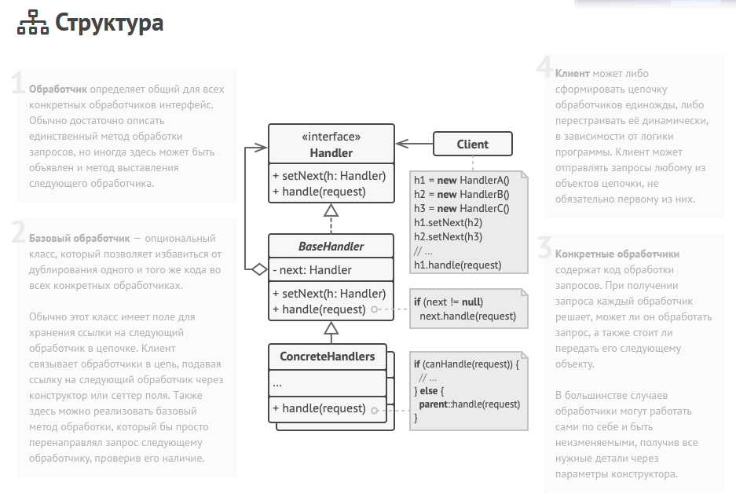

Цепочка обязанностей — это поведенческий паттерн проектирования, который позволяет передавать запросы последовательно по цепочке обработчиков. Каждый
последующий обработчик решает, может ли он обработать запрос сам и стоит ли передавать запрос дальше по цепи.

Примером является распространение TouchEvent по дереву View в Android, где каждая View переопределяет методы onInterceptTouchEvent, решая стоит ли
передавать TouchEvent дальше по дереву.

Преимущества:
- Уменьшает зависимость между клиентом и обработчиками
- Реализует принцип единственной ответственности
- Реализует принцип открытости/закрытости

Недостатки:
- Запрос может быть никем не обработан