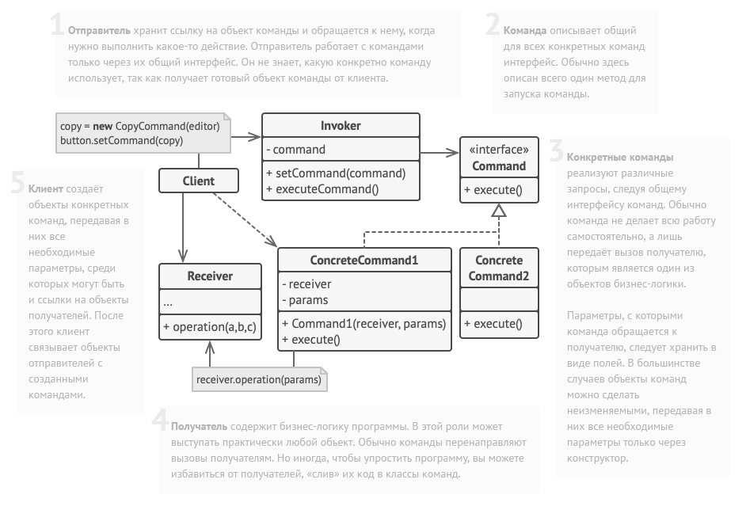

Команда — это поведенческий паттерн проектирования, который оборачивает запросы в объекты, позволяя передавать их как аргументы при вызове методов,
ставить запросы в очередь, логировать их, а также поддерживать отмену операций.

Преимущества:

- Убирает зависимость между объектами, вызывающими операцию, и объектами, которыми выполняют их
- Позволяет реализовать простую отмену и повтор операций
- Позволяет реализовать отложенный запуск операций
- Позволяет собирать сложные команды из простых
- Реализует принцип открытости/закрытости

