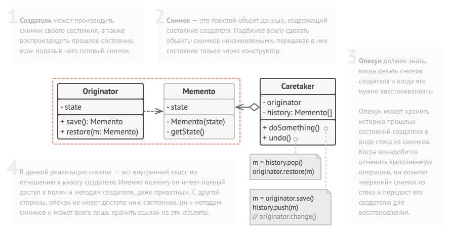

Снимок — это поведенческий паттерн проектирования, который позволяет сохранять и восстанавливать прошлые состояния объектов, не раскрывая подробностей
их реализации. Достигается за счёт того, что созданием спинка занимается сам класс, чьё состояние требуется сохранить. При этом внешние классы имеют
ограниченный интерфейс взаимодействия со снимком.

Преимущества:
- Не нарушает инкапсуляции исходного объекта.
- Упрощает структуру исходного объекта. Ему не нужно хранить историю версий своего состояния.

Недостатки: 
- Требует много памяти, если клиенты слишком часто создают снимки
- Может повлечь дополнительные издержки памяти, если объекты, хранящие историю, не освобождают ресурсы, занятые устаревшими снимками.
