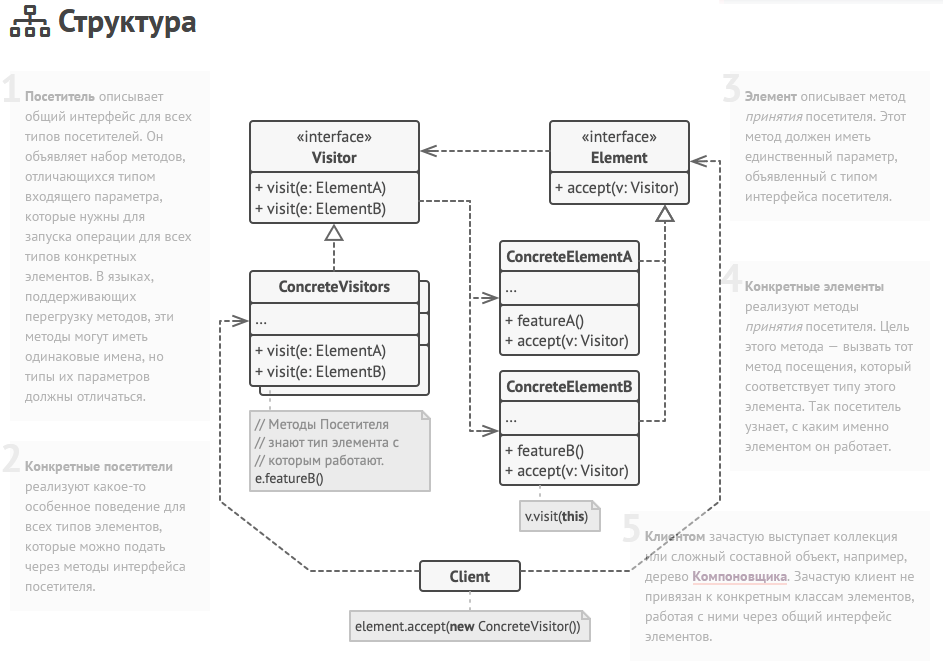

Посетитель — это поведенческий паттерн проектирования, который позволяет добавлять в программу новые операции, не изменяя классы объектов, над
которыми эти операции могут выполняться. Вместо того, чтобы добавлять новый код в классы, объекты этих классов будут передаваться в посетителя,
который будет заниматься некоторой новой логикой, например, экспортом данных в JSON или XML.

