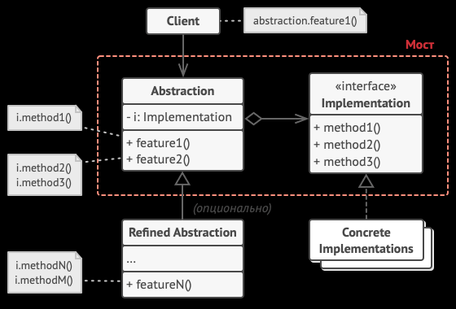

Мост — это структурный паттерн проектирования, который разделяет один или несколько классов на две отдельные иерархии — абстракцию и реализацию,
позволяя изменять их независимо друг от друга. Использует композицию вместо наследования, то есть хранить внутри себя ссылку на другой объект.

Преимущества:

- Скрывает детали реализации от клиентского кода
- Реализует принцип открытости/закрытости

Недостатки:

- Усложняет код засчёт добавления новых классов