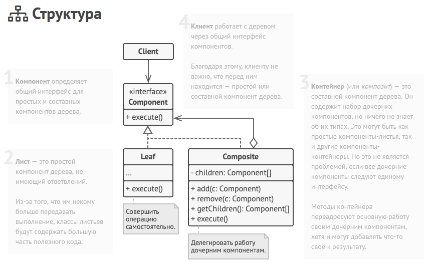

Компоновщик — это структурный паттерн проектирования, который позволяет сгруппировать множество объектов в древовидную структуру, а затем работать с
ней так, как будто это единичный объект. Имеет смысл применять только тогда, когда классы могут образовать древовидную структуру. Таким образом 
клиентский код может работать, как с составными объектами, так и простыми, не зная об этом.

Преимущества:
- Упрощает работу с деревом из клиенсткого кода
- Легко добавить новые компоненты дерева

Недостатки:
- Создаётся слишком общий дизайн классов

