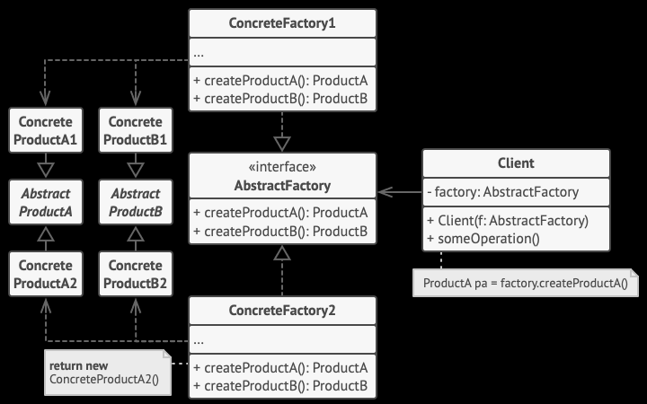

Абстрактная фабрика -- порождающий паттер проектирования, позволяющий создавать семейства связанных объектов, не привязываясь к конкретным
реализициям.
Применяется, когда код программы работает с разными видами продуктов, например, кросс-платформенное приложение работает с элементами UI,
которые могут иметь различную реализацию для конкретных платформ. При этом этот код ниего не знает про конкретные реализации,
а работает с интерфейсами. За счёт работы с интерфейсами легко добавлять поддержку новых видов объектов, не изменяя при этом клиентский код.

Преимущества:

- Гарантирует сочетаемость создаваемых продуктов.
- Избавляет клиентский код от привязки к конкретным классам продуктов.
- Выделяет код производства продуктов в одно место, упрощая поддержку кода.
- Упрощает добавление новых продуктов в программу.
- Реализует принцип открытости/закрытости.

Недостаки:

- Усложняет код программы из-за введения множества дополнительных классов.
- Требует наличия всех типов продуктов в каждой вариации.