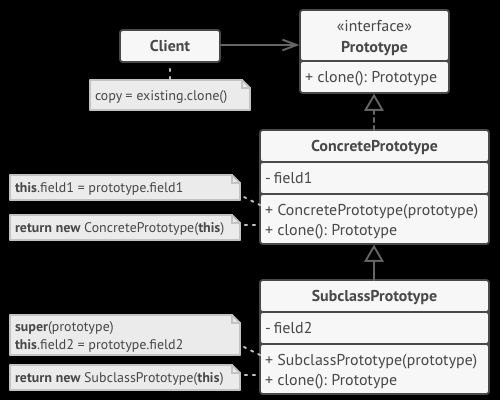

Прототип — это порождающий паттерн проектирования, который позволяет копировать объекты, не вдаваясь в подробности их реализации.
Паттерн прототип делегирует создание копий самим копируемым объектам. Таким образом можно копировать даже значения приватных поле класса,
т.к. код создания находится внутри копируемого класса и не при этом не нарушается инкапсуляция, а код, использующий клонирование через прототип,
не знает и не зависит от внутренного устройства классов.

Преимущества:

- Позволяет клонировать объекты, не привязывась к конкретным реализациям
- Меньше инициализационного кода при создании объектов
- Альтернатива создания подклассов для создания сложных объектов

Недостаки:

- Сложно клонировать составные объекты, содержащие в себе другие объекты