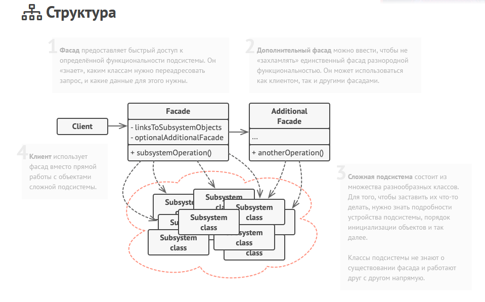

Фасад — это структурный паттерн проектирования, который предоставляет простой интерфейс к сложной системе классов, библиотеке или фреймворку.
Фасад представляет собой простой интерфейс для работы со сложной подсистемой (библиотекой, фреймворком). Полезен, когда не нужна
вся функциональность какой-то системы, а только её часть. Таким образом от клиент скрывается часть сложной логики, инициализиации классов и т.д.

Преимущества:

- Изолирует клиентов от компонентов сложной системы

Недостатки:

- Может стать god объектов, привязанным к большому количеству классов.
