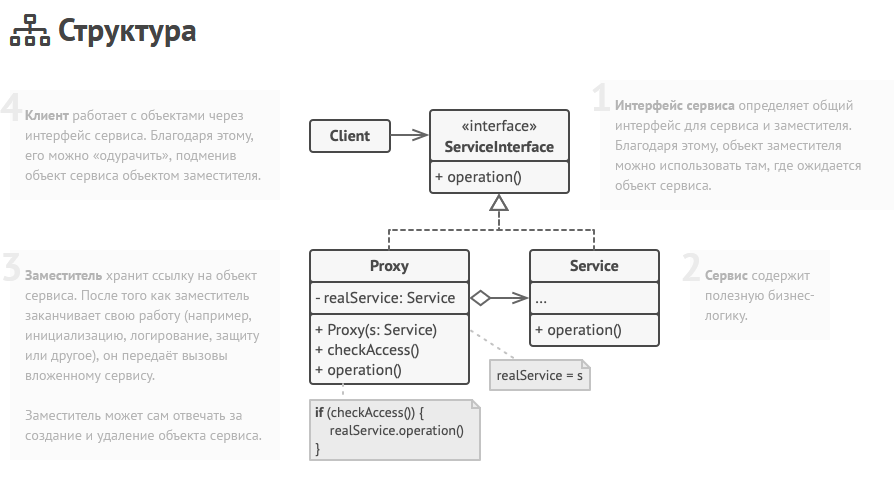

Заместитель — это структурный паттерн проектирования, который позволяет подставлять вместо реальных объектов специальные объекты-заменители. Эти
объекты перехватывают вызовы к оригинальному объекту, позволяя сделать что-то до или после передачи вызова оригиналу.

Этот паттерн похож на декоратор тем, что также добавляет некоторую новую логику классам. Отличие в том, что заместитель сам управляет ЖЦ замещаемого
объекта, а при использовании декоратора этим занимается сам клиентский код.

Преимущества:

- Может контролировать ЖЦ заменяемого объекта
- Позволяет клиенту работать как с заместителем, так и оригинальным объектом так, что клиент ничего не знат об этом
- Может работать, даже если заменяемый объект ещё не создан

Недостатки:

- Увеличивает сложность программы из-за дополнительных классов
- Увеличивает время отклика сервиса
