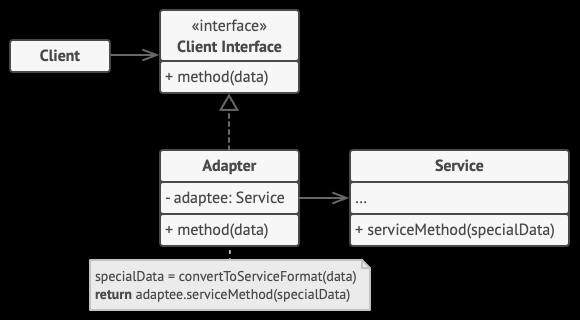

Адаптер — это структурный паттерн проектирования, который позволяет объектам с несовместимыми интерфейсами работать вместе.
Адаптер оборачивает один объект и перенаправляет вызовы ему так, что клиентский код даже не знает о наличии какого-то другого объекта.
Пример -- RecyclerViewAdapter, который переводит данные во ViewHolder'ы, которыми умеет отображать RecyclerView.

Преимущества:
- Скрывает от клиентского кода внешние различные интерфейсы

Недостатки:
- Усложняет код и понимание программы
