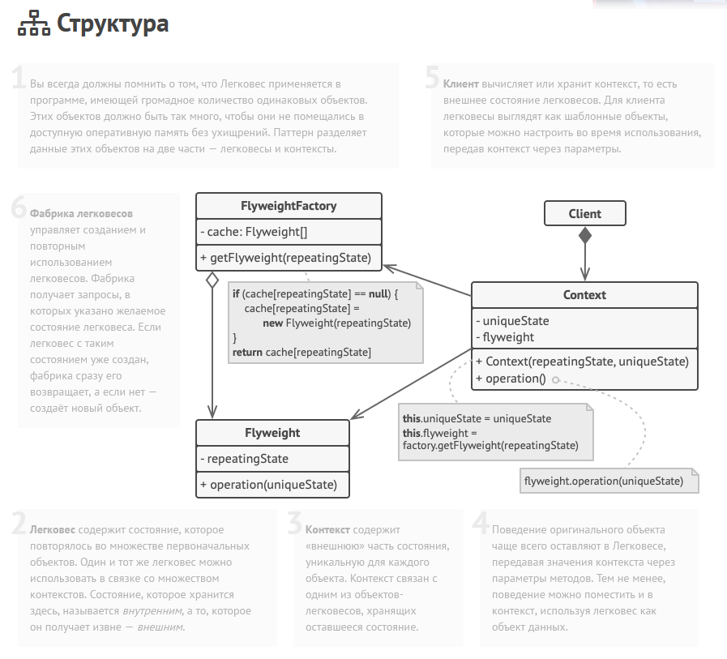

Легковес — это структурный паттерн проектирования, который позволяет вместить бóльшее количество объектов в отведённую оперативную память. Легковес
представляет собой класс, хранящим внутренее состояние объекта, т.е. неизменяемыми данными. Вместо того, чтобы в каждый класс добавлять одинаковые
значения внутреннего состояния (например, цвет частицы или листа дерева), эти параметры выносят в отдельный класс, а затем просто хранят ссылку на
легковес из класса. Однако при таком подходе стоит подумать о том, где хранить легковесы, если не в самом классе. Например, можно это делать в
фабрике.

Преимущества:

- Экономия оперативной памяти

Недостаки:

- Усложнение кода из-да дополнительных классов (например, фабрики для хранения легковесов, а также классов самих легковесов)
- Расходует процессорное время на поиск, вычисления легковесов
