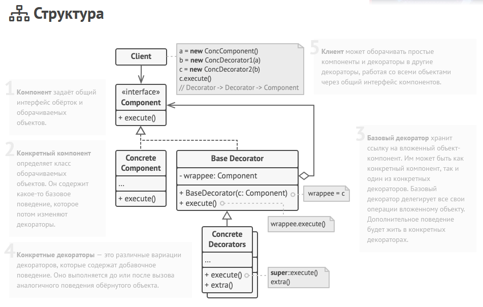

Декоратор — это структурный паттерн проектирования, который позволяет динамически добавлять объектам новую функциональность, оборачивая их в полезные
«обёртки». Также использует композицию, сохраняя объект оборачиваемого класса, являясь при этом наследником этого класса, что позволяет
вкладывать обёртки друг в друга, дополняя их поведение.

Преимущества:

- Большая гибкость, чем у наследования
- Позволяет добавлять функциональность объектам во время выполнения
- Позволяет иметь атомарные фукнциональные объекты, вместо одного большого объекта на все случаи жизни

Недостатки:

- Трудно конфигурировать многократко обёрнутый объекты